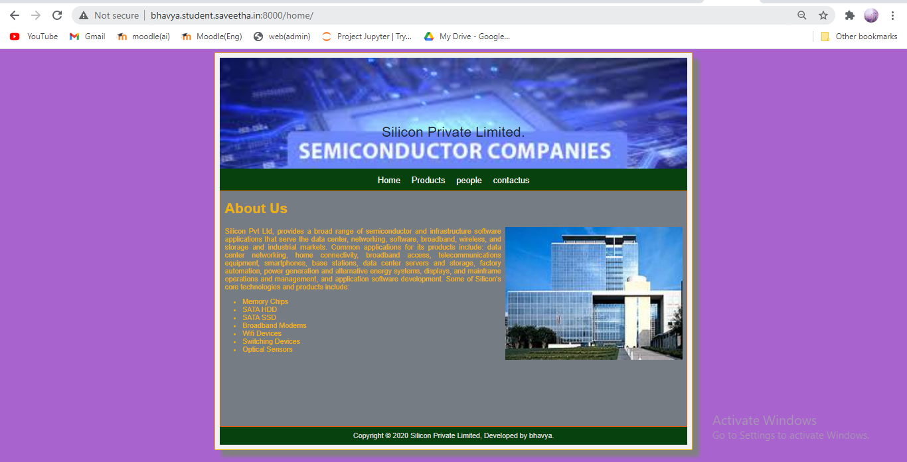
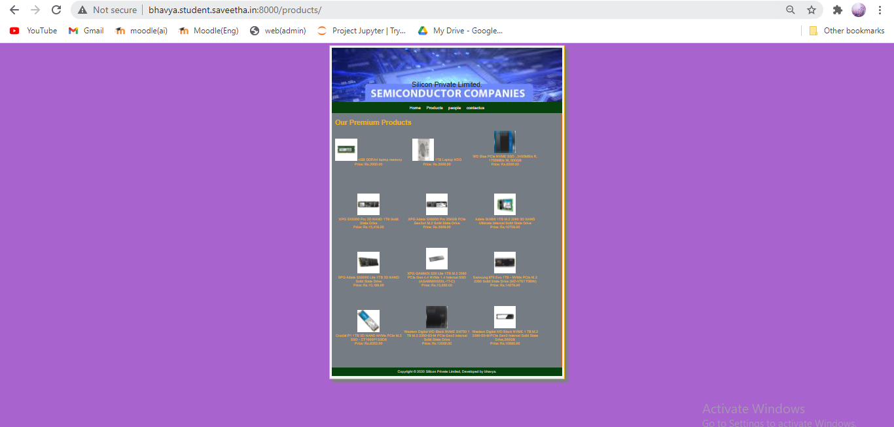
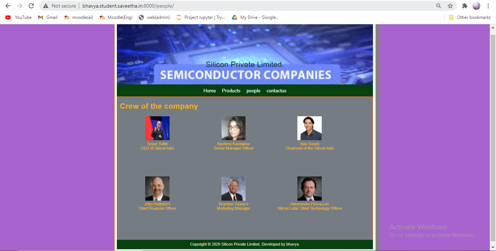
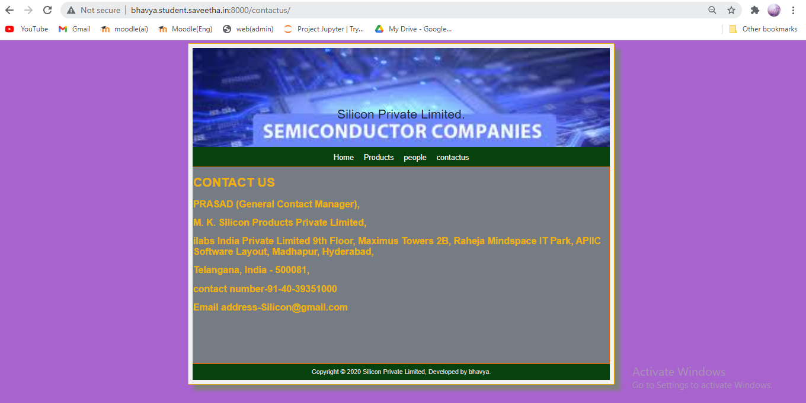
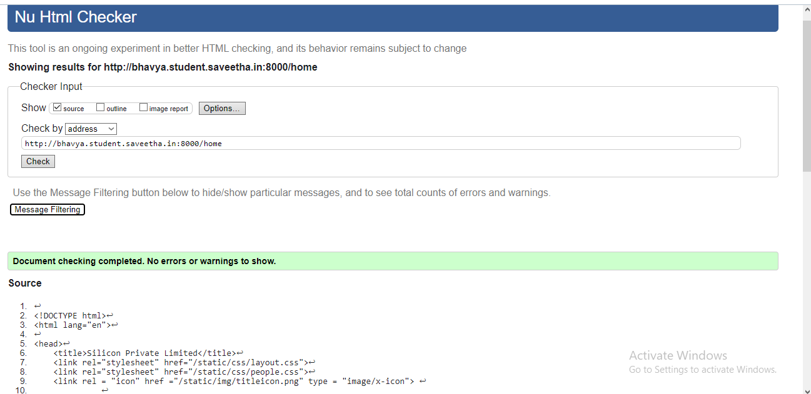
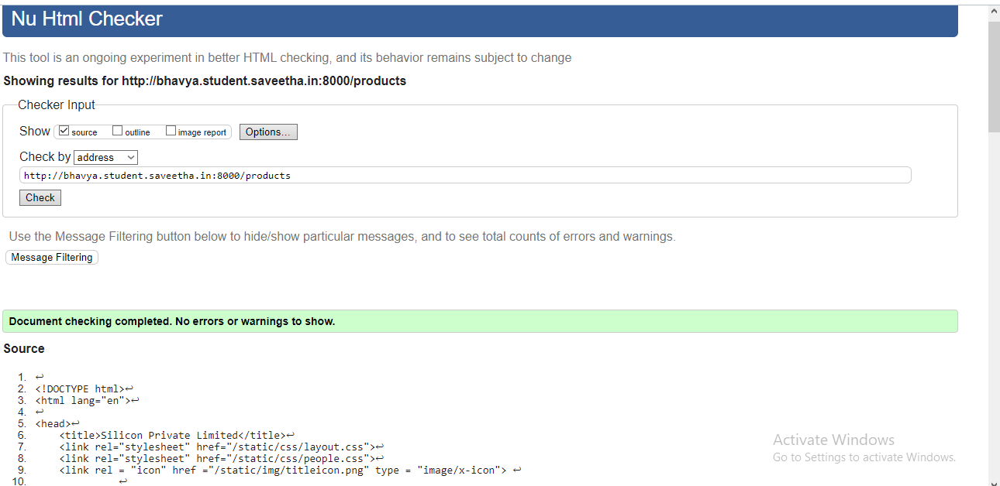
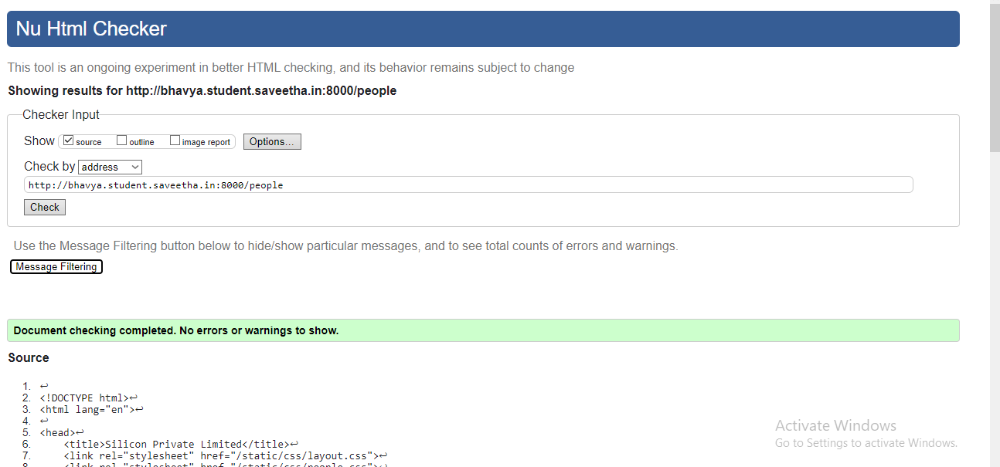
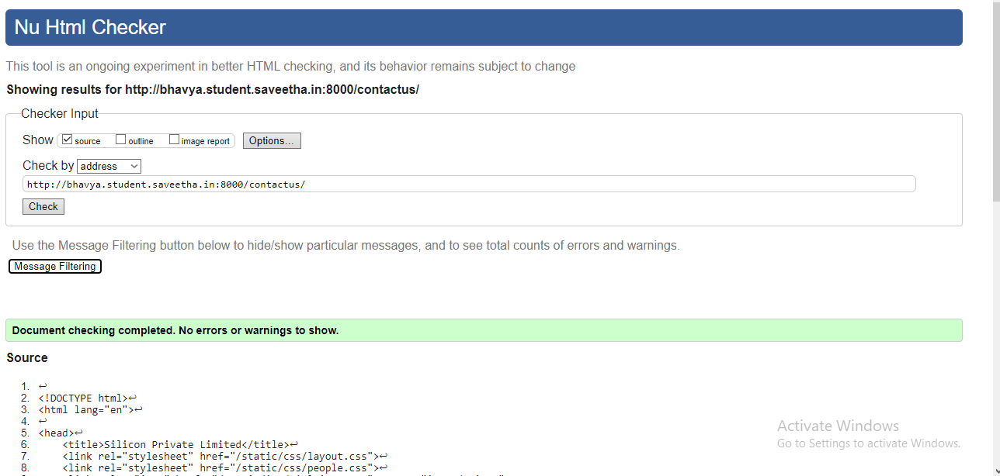

# Web Design for a Manufacturing Company
## AIM: 
To design a static website for a chip manufacturing company.

## DESIGN STEPS:
### Step 1: 
Requirement collection.
### Step 2:
Creating the layout using HTML and CSS.
### Step 3:
Updating the sample content.
### Step 4:
Choose the appropriate style and color scheme.
### Step 5:
Validate the layout in various browsers.
### Step 6:
Validate the HTML code.
### Step 6:
Publish the website in the given URL.

## PROGRAM:

### base.html
```

<!DOCTYPE html>
<html lang="en">

<head>
    <title>Silicon Private Limited</title>
    <link rel="stylesheet" href="">
    <link rel="stylesheet" href="">
    <link rel = "icon" href ="" type = "image/x-icon"> 
              
</head>

<body>
    <div class="container">
    <div class="banner">
        Silicon Private Limited.
    </div>
    <div class="menu">
        <div class="menuitem"><a href="/home">Home</a></div> 
        <div class="menuitem"><a href="/products">Products</a></div> 
        <div class="menuitem"><a href="/people">people</a></div>
        <div class="menuitem"><a href="/contactus">contactus</a></div>
        
    </div><div class="content">
        
    
    </div>
    <div class="footer">
        Copyright © 2020 Silicon Private Limited, Developed by bhavya.
    </div>
    </div>
</body>

</html>
```

### home.html
```



    <div class="homecontent">    
    <h1>About Us</h1>
    
    <div class="contenttext">
    Silicon Pvt Ltd, provides a broad range of semiconductor and infrastructure software applications that serve the data center, networking, software, broadband, wireless, and storage and industrial markets. Common applications for its products include: data center networking, home connectivity, broadband access, telecommunications equipment, smartphones, base stations, data center servers and storage, factory automation, power generation and alternative energy systems, displays, and mainframe operations and management, and application software development. Some of Silicon's core technologies and products include:
    <ul>
        <li>Memory Chips</li>
        <li>SATA HDD</li>
        <li>SATA SSD </li>
        <li>Broadband Modems</li>
        <li>Wifi Devices</li>
        <li>Switching Devices</li>
        <li>Optical Sensors</li>
    </ul> 
    </div>
    </div>

```
### products.html
```



<div class="productcontent">
    <h1>Our Premium Products</h1>
    <div class="productitems">
        <div class="productitem">
            <div class="itemimage">
                
            </div>
            <div class="itemname">4GB DDRA4 laptop memory</div>
            <div class="itemprice">Price: Rs.2000.00 </div>
        </div>
        <div class="productitem">
            <div class="itemimage">
                
            </div>
            <div class="itemname">1TB Laptop HDD</div>
            <div class="itemprice">Price: Rs.5000.00 </div>
        </div>
        <div class="productitem">
            <div class="itemimage">
                
            </div>
            <div class="itemname">WD Blue PCle NVME SSD , 2400MB/s R, 1750MB/s W, 500GB</div>
            <div class="itemprice">Price: Rs.6500.00 </div>
        </div>
        <div class="productitem">
            <div class="itemimage">
                
            </div>
            <div class="itemname">XPG SX8200 Pro 3D NAND 1TB Solid State Drive</div>
            <div class="itemprice">Price: Rs.15,419.00 </div>
        </div>
        <div class="productitem">
            <div class="itemimage">
                
            </div>
            <div class="itemname">XPG Adata SX6000 Pro 256GB PCIe Gen3x4 M.2 Solid State Drive</div>
            <div class="itemprice">Price: Rs.3909.00 </div>
        </div>
        <div class="productitem">
            <div class="itemimage">
                
            </div>
            <div class="itemname">Adata SU800 1TB M.2 2280 3D NAND Ultimate Internal Solid State Drive</div>
            <div class="itemprice">Price: Rs.10759.00 </div>
        </div>
        <div class="productitem">
            <div class="itemimage">
                
            </div>
            <div class="itemname">XPG Adata SX6000 Lite 1TB 3D NAND Solid State Drive</div>
            <div class="itemprice">Price: Rs.10,189.00 </div>
        </div>
        <div class="productitem">
            <div class="itemimage">
                
            </div>
            <div class="itemname">XPG GAMMIX S50 Lite 1TB M.2 2280 PCIe Gen 4.4 NVMe 1.4 Internal SSD (AGAMMIXS50L-1T-C)
            </div>
            <div class="itemprice">Price: Rs.13,650.00 </div>
        </div>
        <div class="productitem">
            <div class="itemimage">
                
            </div>
            <div class="itemname">Samsung 970 Evo 1TB - NVMe PCIe M.2 2280 Solid State Drive (MZ-V7E1T0BW)</div>
            <div class="itemprice">Price: Rs.14679.00 </div>
        </div>
        <div class="productitem">
            <div class="itemimage">
                
            </div>
            <div class="itemname">Crucial P1 1TB 3D NAND NVMe PCIe M.2 SSD - CT1000P1SSD8</div>
            <div class="itemprice">Price: Rs.9252.00 </div>
        </div>
        <div class="productitem">
            <div class="itemimage">
                
            </div>
            <div class="itemname">Western Digital WD Black NVME SN750 1 TB M.2 2280-S3-M PCIe Gen3 Internal Solid State
                Drive</div>
            <div class="itemprice">Price: Rs.12000.00 </div>
        </div>
        <div class="productitem">
            <div class="itemimage">
                
            </div>
            <div class="itemname">Western Digital WD Black NVME 1 TB M.2 2280-S3-M PCIe Gen3 Internal Solid State
                Drive,500GB</div>
            <div class="itemprice">Price: Rs.10980.00 </div>
        </div>
    </div>
</div>

```
### people.html
```



<div class="peoplecontent">
    <h1>Crew of the company</h1>
    <div class="people">
        <div class="crew">
            <div class="peopleimage">
                
            </div>
            <div class="personname">Tyson Tuttle</div>
            <div class="designation">CEO of Silicon labs </div>
        </div>
        <div class="crew">
            <div class="peopleimage">
                
            </div>
            <div class="personname">Neelima Karalgikar</div>
            <div class="designation">Senior Manager Officer </div>
        </div>
        <div class="crew">
            <div class="peopleimage">
                
            </div>
            <div class="personname">Nav Sooch</div>
            <div class="designation">Chairman of the Silicon labs </div>
        </div>
        <div class="crew">
            <div class="peopleimage">
                
            </div>
            <div class="personname">John Hollister's</div>
            <div class="designation"> Chief Financial Officer </div>
        </div>
        <div class="crew">
            <div class="peopleimage">
                
            </div>
            <div class="personname">Brandon Tolany's</div>
            <div class="designation">Marketing Manager </div>
        </div>
        <div class="crew">
            <div class="peopleimage">
                
            </div>
            <div class="personname">Alessandro Piovaccari</div>
            <div class="designation">Silicon Labs' Chief Technology Officer </div>
        </div>
    </div>
</div>

```
### contactus.html
```



<div class="contactuscontent">
    <h1>CONTACT US</h1>
    <div class="contactustext">
        <h2> PRASAD (General Contact Manager),</h2>
        <h2> M. K. Silicon Products Private Limited,</h2>
        <h2> ilabs India Private Limited 9th Floor, Maximus Towers 2B, Raheja Mindspace IT Park, APIIC Software Layout,
            Madhapur, Hyderabad,</h2>
        <h2> Telangana, India - 500081,</h2>
        <h2> contact number-91-40-39351000</h2>
        <h2> Email address-Silicon@gmail.com</h2>

    </div>

</div>


```
## OUTPUT:








## CODE VALIDATION REPORT:







## RESULT:
Thus a website is designed for the chip manufacturing company and is hosted in the URL http://bhavya.student.saveetha.in:8000/. HTML code is validated.